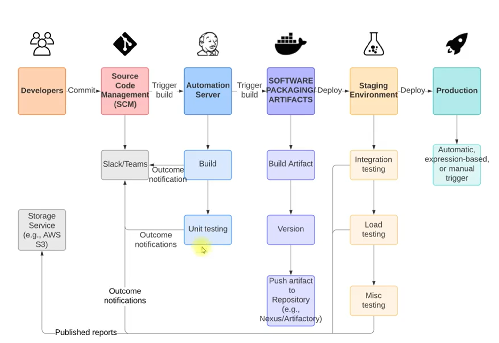

## Continous integration and Delivery project set up using AWS services, Jenkins, Checkstyle maven, sonarqube scanner for code analysis

    - For this project I would be setting it up locally using VMs and not cloud EC2 instances due to cost. 

- This project involves setting up of a continous integration pipeline for v-profile application written in Java. We would be using the below AWS web services for this project:

    - Jenkins                                                           | Used for pipeline build and continous integration
    - Git                                                               | Used for version control and code management
    - Maven                                                             | Build tool for java application, since this is a java project
    - Checkstyle                                                        | Used for code testing 
    - Slack                                                             | Used for notification 
    - Nexus repository                                                  | Repository manager, would store artifacts 
    - Sonarqube server                                                  | Code testing quality gates also
    - Apache Tomcat server                                              | Server for deploying the application - Continous Delivery section
    - Backend servers running (MySQL, Rabbitmq service and Memcache)    | Backend services - Continous Delivery section 
    - Selenium for software testing 
    - Windows server - Slave for testing on jenkins server 
    - AWS EC2 Instances or you can use local VMs 

## Project Architecture 



## Flow of execution on AWS 

    - Log into AWS 
    - Create key pair for EC2 instances 
    - Create SG for instances:
        - Jenkins running on port 8080, port 22 allow from MyIP as inbound rules, port 80 to grant access to sonarqube to upload reports or choose all traffic from sonar qube SG. 
        - Sonarqube server running on port 9000 and 22 allow from MyIp, port 80 allow from MyIP to use nginx, 80 all from jenkins SG to grant access for report upload. 
        - Nexus server running on port 8081 and port 22 allow from MyIP as inbound rules. Also allow port 8081 from jenkins Security Group to grant access to jenkins for artifacts upload. 
        - Windows server 
        - Tomcat and Backend servers for MySQL, RabbitMQ and Memcached
    - Create EC2 instances with user data (You can also writ playbooks and use ansible to provision this)
        - Jenkins server running on port 8080
        - Sonarqube server running on port 9000
        - Nexus server running on port 8081
        - Tomcat server running on port 80
    - Post Installation steps for both CI & CD steps: 
        - Nexus repository set up - Create 3 repositories
        - Sonarqube server set up     
        - Tomcat server set up 
        - Backend services set up on Backend servers
        - Jenkins set up
            - Build Job - to build artifacts 
            - Set up slack notification 
            - Checkstyle code analysis job 
            - Set up sonarqube integration 
            - Set up sonarqube code analysis job
            - Artifact upload job
    - Connect all jobs together with the build pipeline plugin 
    - Set automatic build trigger using webhooks
    - Test auto trigger with Git using a git push command 
    - Create jenkins job to deploy artifact to staging area 
    - Add a windows node as a slave to Jenkins for executing software tests
    - Create a job to run software tests from windows server 
    - Deploy artifact to production - tomcat server
    - Connect all jobs again with Build Pipeline 
    - Test auto trigger one more time 

## Backend server set up using vagrant.exe file to provision the backend services follow the below set up. 

    - Use the instructions in the pdf file attached to provision services.

Services
1. Nginx => Web Service working on port 80
2. Tomcat => Application Server working on port 8080
3. RabbitMQ => Broker/Queuing Agent works on port 5672
4. Memcache => DB Caching works on port 11211 and 11111
5. ElasticSearch => Indexing/Search service
6. MySQL => SQL Database works on port 3306

Setup should be done in below mentioned order if setting up manually. I would be setting this all up at once using vagrant with embedded script for each VM. 

1. MySQL (Database SVC)
2. Memcache (DB Caching SVC)
3. RabbitMQ (Broker/Queue SVC)
4. Tomcat (Application SVC)
5. Nginx (Web SVC)

```bash
vagrant.exe up
vagrant.exe global-status                   | Used to show all previous vms 
vagrant.exe global-status --prune           } Used to prune all old vms, would clear all previous VMs
```